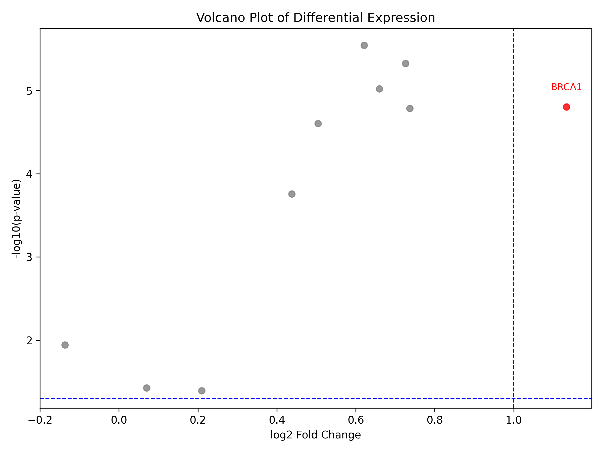
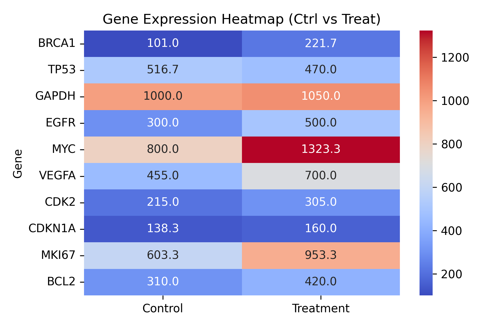

# 🧬 Gene Expression Analysis Project

本專案使用 Python 進行基因表現資料的差異分析與視覺化，並透過互動式介面（Google Colab）讓使用者能即時選擇基因並檢視 boxplot 圖。

---

## 📁 專案內容

| 檔案名稱 | 說明 |
|----------|------|
| `gene_analysis.ipynb` | 主要分析流程（支援互動式選單） |
| `RNA_expression_mock_data.csv` | 原始基因表現資料 |
| `differential_expression_results.csv` | 所有基因的 Log2FC 與 P-value 統計結果 |
| `significant_genes.csv` | 篩選條件（log2FC > 1 且 p < 0.05）下的顯著基因 |
| `heatmap.png` | 顯著基因的熱圖 |
| `volcano_plot.png` | 火山圖：顯示顯著性與表現量變化 |

---

## 📊 分析流程概述

1. 載入基因表現資料
2. 計算對照組與處理組的平均表現
3. 使用 `t-test` 比較兩組間差異
4. 計算 log2 fold change (log2FC)
5. 篩選顯著基因（log2FC > 1 且 p-value < 0.05）
6. 視覺化：boxplot、heatmap、volcano plot
7. 匯出結果檔案

---

## ▶️ 開啟互動分析（使用 Google Colab）

點擊下方按鈕，即可在 Colab 中互動式執行分析程式：

markdown  

---

## 🧪 範例圖表

### 🔥 火山圖（Volcano Plot）

### 🌡️ 熱圖（Heatmap）

---

## 📄 License

本專案使用 MIT License 授權，歡迎自由使用與參考。

--- 
